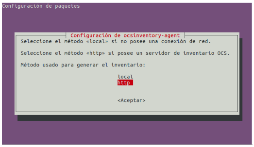
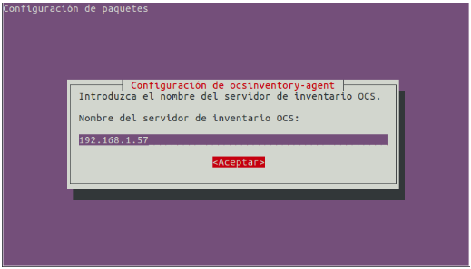
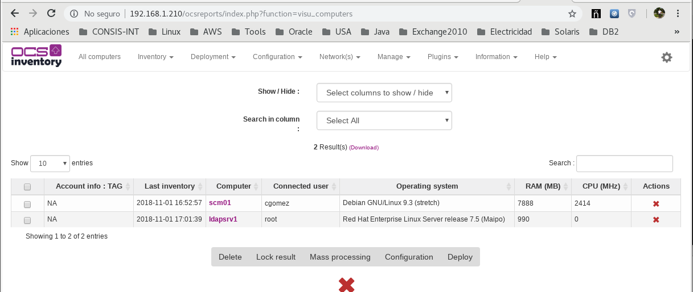

Instalar cliente de OCS Inventory
=====================================

Vamos a realizar la instalación del agente OCS Inventory en Linux con tecnologia DEB y RPM unicamente.

IMPORTANTE: recordar que los agentes se comunicaran con la configuración que esta en el server en el archivo **z-ocsinventory-server.conf** el cual contine los datos de conexión a la BD, para que el cliente registre su información.

Instalar y configurar OCS Inventory para los DEB
++++++++++++++++++++++++++++++++++++++++++++++++++

Instalamos el agente que ya esta en el repositorio por defecto::

	apt-cache search  ocsinventory
	apt-get install ocsinventory-agent

Elegir el método para generar el inventario del equipo; Puede ser local (para que genere el informe en un archivo especial de ocs, que se puede importar en el server), o http (cuando existe un servidor OCS Inventory y esta disponible a nivel de red). En nuestro caso, seleccionamos “http”.

Solicita la instalación es la IP o nombre DNS del servidor OCS Inventory.

Ahora ejecutamos::

	ocsinventory-agent 
		[info] No support detected. Registration key: N/A
		[info] [download] Download is off.

		comment OCS-Inventory
		startvm 5e24952d-fd29-4fcb-91e1-54086e97e45f
		no-startvm-errormsgbox
		[info] [download] Beginning work. I am 11037.
		[info] [download] Option turned off. Exiting.

Instalar y configurar OCS Inventory para los RPM
++++++++++++++++++++++++++++++++++++++++++++++++

Para Oracle Linux debemos descargar el repositorio de OCS Inventory e instalarlo::

	wget https://rpm.ocsinventory-ng.org/ocsinventory-release-latest.el7.ocs.noarch.rpm
	rpm -ivh ocsinventory-release-latest.el7.ocs.noarch.rpm

Antes de continuar debemos instalar este RPM que es una dependencia y no esta en los repositorios::

	http://mirror.centos.org/centos/7/os/x86_64/Packages/perl-Crypt-DES-2.05-20.el7.x86_64.rpm
	rpm -ivh perl-Crypt-DES-2.05-20.el7.x86_64.rpm

Instalamos este otro modulo requerido por el agente::
	
	yum install perl-LWP-Protocol-https

Editamos el archivo de configuración para agregar el server OCS Inventory::

	vi /etc/ocsinventory/ocsinventory-agent.cfg
	[...]
	server=192.168.1.210
Comente la linea en donde esta el "local" y agregue la linea de "basevardir"::

	# local = /var/lib/ocsinventory-agent
	basevardir = /var/lib/ocsinventory-agent

Ahora ejecutamos::

	ocsinventory-agent 

Ya con lo anterior debemos ver la información recolectada de los agentes en el server de OCS Inventory.

Este es un ejemplo del archivo **ocsinventory-agent.cfg**::

	# OCS Inventory "Unix Unified Agent" Configuration File
	#
	# options used by cron job overides this (see /etc/sysconfig/ocsinventory-agent)
	#

	# Server URL, unconmment if needed
	# server = your.ocsserver.name
	# local = /var/lib/ocsinventory-agent
	basevardir = /var/lib/ocsinventory-agent

	# Administrative TAG (optional, must be filed before first inventory)
	# tag = your_tag

	# How to log, can be File,Stderr,Syslog
	logger = Stderr
	logfile = /var/log/ocsinventory-agent/ocsinventory-agent.log

	server=192.168.1.210

**No olvide colocar un cron para que ejecute los agentes cada cierto tiempo.**

