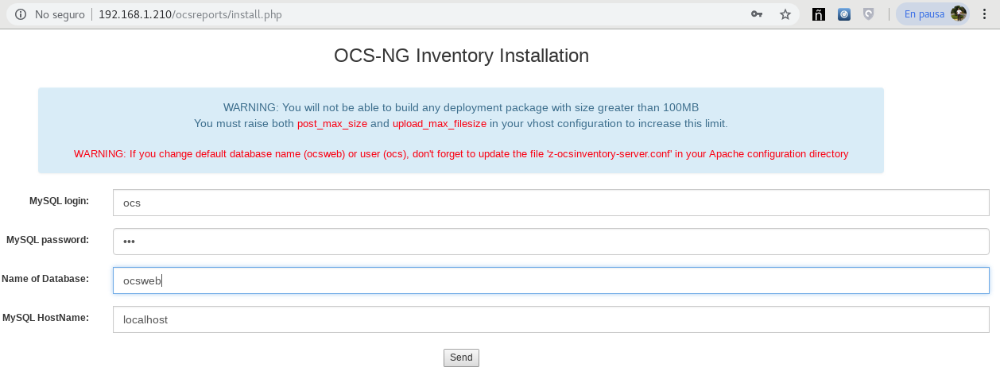
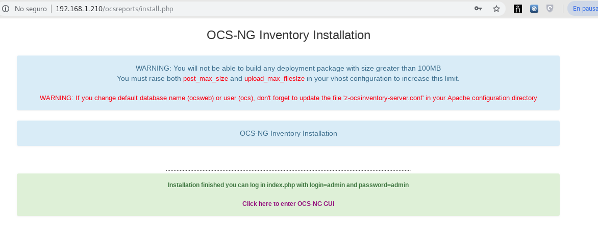
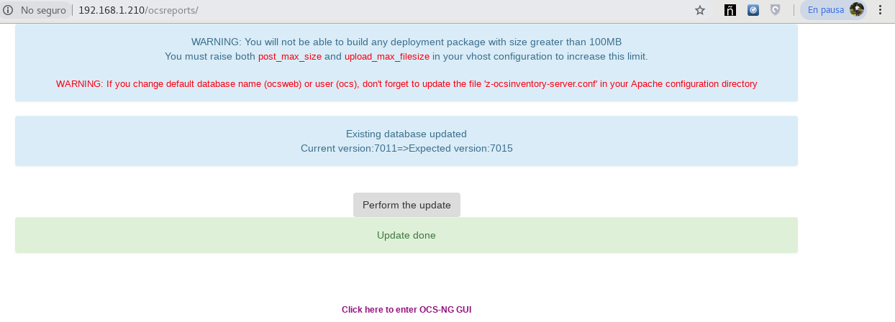
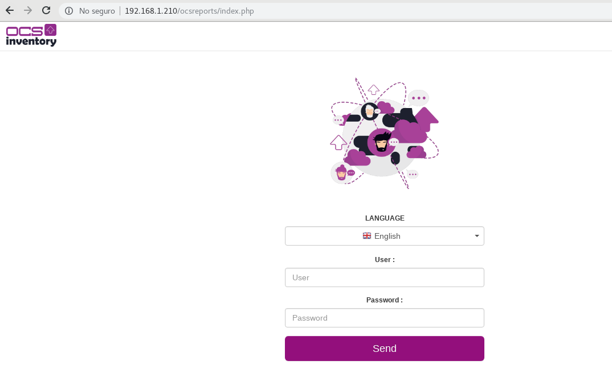

Instalación Rapida
==================

En esta configuración se utilizaran dos servidores que llamaremos **nodo01** y **nodo02**, 
En el nodo01 estará instalado:
* La Base de Datos
* El Servidor de comunicaciones

En el nodo02 estará instalado:
El servidor para la Consola de administración

configuremos el EPEL su ultimo release
+++++++++++++++++++++++++++++++++++++++

**En OracleLinux/Redhat/Centos 7 como Linux**, en nodo01 y nodo02::

	yum install -y wget
	
	wget http://dl.fedoraproject.org/pub/epel/epel-release-latest-7.noarch.rpm
	rpm -ivh epel-release-latest-7.noarch.rpm
	yum update
	yum install -y perl

Instalar PHP 5.X
+++++++++++++++++++++++
Vamos a instalar PHP 5.X con la ayuda de los repos de remi, en nodo01 y nodo02.::

	yum install -y http://rpms.remirepo.net/enterprise/remi-release-7.rpm

Instalamos yum-utils::

	yum install -y yum-utils

Habilitamos el repositorio del PHP que requerimos instalar::

	yum-config-manager --enable remi-php55   # [Install PHP 5.5]
	yum-config-manager --enable remi-php56   # [Install PHP 5.6]
	yum-config-manager --enable remi-php72   # [Install PHP 7.2]

Instalamos los siguientes componentes que son necesarios para OCS Inventory::

	yum-config-manager --enable remi-php56   # [Install PHP 5.6]
	yum install -y php php-common php-zip php-gd php-mbstring php-soap php-mysql php-xml php-pecl-zip 

Habilitamos y Reiniciamos el Apache.::

	systemctl restart httpd
	systemctl enable httpd

Vamos hacer una prueba para certificar que php esta integrado con apache.::

	vi /var/www/html/testphp.php

	<?php
	// Muestra toda la informacion de PHP
	phpinfo();
	// Muestra la informacion de los modulos
	phpinfo(INFO_MODULES);
	?>

Instalar Mariadb server
========================

El servidor de inventario de OCS necesita una base de datos para almacenar información del inventario

Agregue el repositorio de MariaDB en /etc/yum.repos.d/ , en nodo01 y nodo02::

	vi /etc/yum.repos.d/MariaDB.repo

	[mariadb]
	name = MariaDB
	baseurl = http://yum.mariadb.org/10.1/centos7-amd64
	gpgkey=https://yum.mariadb.org/RPM-GPG-KEY-MariaDB
	gpgcheck=1

En OracleLinux/Redhat/Centos 7 puede usar "yum" para instalar mariadb **Server** en el nodo01::

	yum install -y MariaDB-server

En OracleLinux/Redhat/Centos 7 puede usar "yum" para instalar mariadb **Client** en el nodo02::

	yum install -y MariaDB-client

Primer paso que necesitamos para launchr MariaDB. En OracleLinux/Redhat/Centos 7, debe habilitar e iniciar mariadb primero,en el nodo01::

	systemctl status mariadb
	systemctl enable mariadb
	systemctl start mariadb

En la instalación de mysql hay un paso que le pide que coloque la contraseña de root para Mysql (no lo olvide). Cuando culmina la instalación corremos el script. en el nodo01::

	mysql_secure_installation

Esta parte es solo si desea instalar el servidor de bases de datos, el servidor de comunicaciones y la consola de administración en un servidor separado

Primer paso para crear la base de datos, en el nodo01::

	mysql -uroot -p

Creamos la Base de Datos::

	CREATE DATABASE ocsweb;

Para un servidor separado, debe tener dos usuarios si utiliza un servidor diferente para la base de datos, el servidor de comunicaciones y la consola de administración::

	CREATE USER 'ocs'@'localhost' IDENTIFIED BY 'ocs';
	CREATE USER 'ocs'@'CommunicationServerIP' IDENTIFIED BY 'ocs';
	CREATE USER 'ocs'@'AdministrationConsoleIP' IDENTIFIED BY 'ocs';

Nota: 
	si desea implementar OCS en solo dos servidores, solo necesita crear un usuario con la IP del servidor de comunicaciones/consola de administración si instala un servidor de base de datos y otro servidor para la consola de administración/servidor de comunicaciones.

Entonces el usuario necesita todos los privilegios en la base de datos "ocsweb"::

	GRANT ALL PRIVILEGES ON ocsweb.* TO 'ocs'@'localhost' WITH GRANT OPTION;
	GRANT ALL PRIVILEGES ON ocsweb.* TO 'ocs'@'CommunicationServerIP' WITH GRANT OPTION;
	GRANT ALL PRIVILEGES ON ocsweb.* TO 'ocs'@'AdministrationConsoleIP' WITH GRANT OPTION;

No olvides aplicar los parámetros::

	FLUSH PRIVILEGES;

Instalación de Perl y sus módulos
++++++++++++++++++++++++++++++++++

Instalar Perl y sus módulos en nodo01 y nodo02.::

		yum install -y perl

Vamos a instalar estos paquetes primero, que son dependencias y no estan en los repositorios de Oracle Linux ni en EPEL, en nodo01 y nodo02::

	wget http://mirror.centos.org/centos/7/os/x86_64/Packages/perl-Devel-StackTrace-1.30-2.el7.noarch.rpm
	rpm -ivh perl-Devel-StackTrace-1.30-2.el7.noarch.rpm

	wget http://mirror.centos.org/centos/7/os/x86_64/Packages/perl-File-pushd-1.005-2.el7.noarch.rpm
	rpm -ivh perl-File-pushd-1.005-2.el7.noarch.rpm

	wget http://mirror.centos.org/centos/7/os/x86_64/Packages/perl-Class-Inspector-1.28-2.el7.noarch.rpm
	rpm -ivh perl-Class-Inspector-1.28-2.el7.noarch.rpm

	wget http://mirror.centos.org/centos/7/os/x86_64/Packages/perl-Switch-2.16-7.el7.noarch.rpm
	rpm -ivh perl-Switch-2.16-7.el7.noarch.rpm

	wget http://rpms.remirepo.net/enterprise/7/remi/x86_64//perl-Apache2-SOAP-0.73-13.el7.remi.noarch.rpm
	yum install -y perl-SOAP-Lite
	rpm -ivh perl-Apache2-SOAP-0.73-13.el7.remi.noarch.rpm

	wget https://harbottle.gitlab.io/epmel/7/x86_64//perl-Apache-DBI-1.12-2.el7.noarch.rpm
	yum install -y perl-Digest-MD5.x86_64 perl-Digest-SHA1.x86_64 perl-Test-Simple perl-DBI.x86_64
	rpm -ivh perl-Apache-DBI-1.12-2.el7.noarch.rpm

**En Redhat/Centos 7 como Linux**:, puede usar "yum" para configurar los módulos requeridos, en nodo01 y nodo02::

	yum install -y perl-XML-Simple perl-Compress-Zlib perl-DBI perl-DBD-MySQL perl-Net-IP perl-SOAP-Lite perl-Archive-Zip perl-Mojolicious perl-Plack perl-XML-Entities perl-Switch perl-YAML.noarch perl-DBD-MySQL

Descargar el OCS Inventory
++++++++++++++++++++++++++++++++++++

Debe tener privilegios de root para configurar OCS Inventory Server.

Descargue la última versión del servidor tarball "OCSNG_UNIX_SERVER-2.4.x.tar.gz" desde el sitio web de inventario de OCS, en nodo01 y nodo02::

	wget https://github.com/OCSInventory-NG/OCSInventory-ocsreports/releases/download/2.5/OCSNG_UNIX_SERVER_2.5.tar.gz
	tar xvzf OCSNG_UNIX_SERVER_2.5.tar.gz
	cd OCSNG_UNIX_SERVER_2.5

Instalar el Servidor de comunicaciones
+++++++++++++++++++++++++++++++++++++++

Instalar el Servidor de comunicaciones en el nodo01.

Ejecute el instalador "setup.sh". Durante el instalador, la opción predeterminada se presenta entre []. Por ejemplo, [y] / n significa que "y" (sí) es la opción predeterminada, y "n" (no) es la otra opción.::

	./setup.sh

	+----------------------------------------------------------+
	|                                                          |
	|  Welcome to OCS Inventory NG Management server setup !   |
	|                                                          |
	+----------------------------------------------------------+

	Trying to determine which OS or Linux distribution you use
	+----------------------------------------------------------+
	| Checking for Apache web server binaries !				|
	+----------------------------------------------------------+

	CAUTION: If upgrading Communication server from OCS Inventory NG 1.0 RC2 and
	previous, please remove any Apache configuration for Communication Server!

	Do you wish to continue ([y]/n)?
	Assuming Communication server 1.0 RC2 or previous is not installed
	on this computer.

	Starting OCS Inventory NG Management server setup from folder /etc/yum.repos.d/OCSNG_UNIX_SERVER_2.5
	Storing log in file /etc/yum.repos.d/OCSNG_UNIX_SERVER_2.5/ocs_server_setup.log

	+----------------------------------------------------------+
	| Checking for database server properties...			  |
	+----------------------------------------------------------+

	Your MySQL client seems to be part of MySQL version 10.1.
	Your computer seems to be running MySQL 4.1 or higher, good ;-)

	Which host is running database server [localhost] ?
	OK, database server is running on host localhost ;-)

	On which port is running database server [3306] ?
	OK, database server is running on port 3306 ;-)

	+----------------------------------------------------------+
	| Checking for Apache web server daemon...				|
	+----------------------------------------------------------+

	Where is Apache daemon binary [/usr/sbin/httpd] ?
	OK, using Apache daemon /usr/sbin/httpd ;-)

	+----------------------------------------------------------+
	| Checking for Apache main configuration file...		  |
	+----------------------------------------------------------+

	Where is Apache main configuration file [/etc/httpd/conf/httpd.conf] ?
	OK, using Apache main configuration file /etc/httpd/conf/httpd.conf ;-)

	+----------------------------------------------------------+
	| Checking for Apache user account...					 |
	+----------------------------------------------------------+

	Which user account is running Apache web server [apache] ?
	OK, Apache is running under user account apache ;-)

	+----------------------------------------------------------+
	| Checking for Apache group...							|
	+----------------------------------------------------------+

	Which user group is running Apache web server [apache] ?
	OK, Apache is running under users group apache ;-)

	+----------------------------------------------------------+
	| Checking for Apache Include configuration directory...   |
	+----------------------------------------------------------+

	Setup found Apache Include configuration directory in
	/etc/httpd/conf.d.
	Setup will put OCS Inventory NG Apache configuration in this directory.
	Where is Apache Include configuration directory [/etc/httpd/conf.d] ?
	OK, Apache Include configuration directory /etc/httpd/conf.d found ;-)

	+----------------------------------------------------------+
	| Checking for PERL Interpreter...						|
	+----------------------------------------------------------+

	Found PERL interpreter at </usr/bin/perl> ;-)
	Where is PERL interpreter binary [/usr/bin/perl] ?
	OK, using PERL interpreter /usr/bin/perl ;-)

	Do you wish to setup Communication server on this computer ([y]/n)?

	+----------------------------------------------------------+
	|             Checking for Make utility...                 |
	+----------------------------------------------------------+

	OK, Make utility found at </usr/bin/make> ;-)

	+----------------------------------------------------------+
	|        Checking for Apache mod_perl version...           |
	+----------------------------------------------------------+

	Checking for Apache mod_perl version 1.99_22 or higher
	Found that mod_perl version 1.99_22 or higher is available.
	OK, Apache is using mod_perl version 1.99_22 or higher ;-)

	+----------------------------------------------------------+
	|    Checking for Communication server log directory...    |
	+----------------------------------------------------------+

	Communication server can create detailed logs. This logs can be enabled
	by setting integer value of LOGLEVEL to 1 in Administration console
	menu Configuration.
	Where to put Communication server log directory [/var/log/ocsinventory-server] ?
	OK, Communication server will put logs into directory /var/log/ocsinventory-server ;-)

	+----------------------------------------------------------------------------+
	|    Checking for Communication server plugins configuration directory...    |
	+----------------------------------------------------------------------------+

	Communication server need a directory for plugins configuration files. 
	Where to put Communication server plugins configuration files [/etc/ocsinventory-server/plugins] ?
	OK, Communication server will put plugins configuration files into directory /etc/ocsinventory-server/plugins ;-)

	+-------------------------------------------------------------------+
	|   Checking for Communication server plugins perl directory...     |
	+-------------------------------------------------------------------+

	Communication server need a directory for plugins Perl modules files.
	Where to put Communication server plugins Perl modules files [/etc/ocsinventory-server/perl] ?
	OK, Communication server will put plugins Perl modules files into directory /etc/ocsinventory-server/perl ;-)

	+----------------------------------------------------------+
	| Checking for required Perl Modules...					|
	+----------------------------------------------------------+

	Checking for DBI PERL module...
	Found that PERL module DBI is available.
	Checking for Apache::DBI PERL module...
	Found that PERL module Apache::DBI is available.
	Checking for DBD::mysql PERL module...
	Found that PERL module DBD::mysql is available.
	Checking for Compress::Zlib PERL module...
	Found that PERL module Compress::Zlib is available.
	Checking for XML::Simple PERL module...
	Found that PERL module XML::Simple is available.
	Checking for Net::IP PERL module...
	Found that PERL module Net::IP is available.
	Checking for SOAP::Lite Perl module...
	Found that PERL module SOAP::Lite is available.
	Checking for Archive::Zip Perl module...
	Found that PERL module Archive::Zip is available.

	+----------------------------------------------------------+
	|         Checking for optional Perl Modules...            |
	+----------------------------------------------------------+

	Checking for Apache2::SOAP PERL module...
	Found that PERL module SOAP::Apache2 is available.
	Checking for XML::Entities PERL module...
	Found that PERL module XML::Entities is available.

	Do you wish to setup Rest API server on this computer ([y]/n)?

	+----------------------------------------------------------+
	| Checking for REST API Dependencies ...              		 |
	+----------------------------------------------------------+

	Found that PERL module Mojolicious::Lite is available.
	Found that PERL module Switch is available.
	Found that PERL module Plack::Handler is available.

	+----------------------------------------------------------+
	| Configuring REST API Server files ...               		 |
	+----------------------------------------------------------+

	Where do you want the API code to be store [/usr/lib64/perl5/vendor_perl] ?
	Copying files to /usr/lib64/perl5/vendor_perl

	+----------------------------------------------------------+
	| Configuring REST API Server configuration files ...  		 |
	+----------------------------------------------------------+

	+----------------------------------------------------------+
	|                 OK, looks good ;-)                       |
	|                                                          |
	|     Configuring Communication server Perl modules...     |
	+----------------------------------------------------------+

	Checking if your kit is complete...
	Looks good
	Writing Makefile for Apache::Ocsinventory

	+----------------------------------------------------------+
	|                 OK, looks good ;-)                       |
	|                                                          |
	|      Preparing Communication server Perl modules...      |
	+----------------------------------------------------------+

	+----------------------------------------------------------+
	|                 OK, prepare finshed ;-)                  |
	|                                                          |
	|     Installing Communication server Perl modules...      |
	+----------------------------------------------------------+

	+----------------------------------------------------------+
	| OK, Communication server Perl modules install finished;-)|
	|                                                          |
	|     Creating Communication server log directory...       |
	+----------------------------------------------------------+

	Creating Communication server log directory /var/log/ocsinventory-server.

	Fixing Communication server log directory files permissions.
	Configuring logrotate for Communication server.
	Removing old communication server logrotate file /etc/logrotate.d/ocsinventory-NG
	Writing communication server logrotate to file /etc/logrotate.d/ocsinventory-server

	+----------------------------------------------------------------------+
	|        OK, Communication server log directory created ;-)            |
	|                                                                      |
	|   Creating Communication server plugins configuration directory...   |
	+----------------------------------------------------------------------+

	Creating Communication server plugins configuration directory /etc/ocsinventory-server/plugins.

	+----------------------------------------------------------------------+
	| OK, Communication server plugins configuration directory created ;-) |
	|                                                                      |
	|        Creating Communication server plugins Perl directory...       |
	+----------------------------------------------------------------------+

	Creating Communication server plugins Perl directory /etc/ocsinventory-server/perl.

	+----------------------------------------------------------------------+
	|     OK, Communication server plugins Perl directory created ;-)      |
	|                                                                      |
	|               Now configuring Apache web server...                   |
	+----------------------------------------------------------------------+

	To ensure Apache loads mod_perl before OCS Inventory NG Communication Server,
	Setup can name Communication Server Apache configuration file
	'z-ocsinventory-server.conf' instead of 'ocsinventory-server.conf'.
	Do you allow Setup renaming Communication Server Apache configuration file
	to 'z-ocsinventory-server.conf' ([y]/n) ?
	OK, using 'z-ocsinventory-server.conf' as Communication Server Apache configuration file
	Removing old communication server configuration to file /etc/httpd/conf.d/ocsinventory.conf
	Writing communication server configuration to file /etc/httpd/conf.d/z-ocsinventory-server.conf

	+----------------------------------------------------------------------+
	|       OK, Communication server setup successfully finished ;-)       |
	|                                                                      |
	| Please, review /etc/httpd/conf.d/z-ocsinventory-server.conf |
	|         to ensure all is good. Then restart Apache daemon.           |
	+----------------------------------------------------------------------+

	Do you wish to setup Administration Server (Web Administration Console)
	on this computer ([y]/n)?n

	Setup has created a log file /etc/yum.repos.d/OCSNG_UNIX_SERVER_2.5/ocs_server_setup.log. Please, save this file.
	If you encounter error while running OCS Inventory NG Management server,
	we can ask you to show us his content !

	DON'T FORGET TO RESTART APACHE DAEMON !

	Enjoy OCS Inventory NG ;-)

Debemos asegurar estos permisos::

	chown -R apache.apache /var/lib/ocsinventory-reports

Reiniciamos el Apache.::

	systemctl restart httpd

Instalar el Servidor Consola de administración
+++++++++++++++++++++++++++++++++++++++

Instalar el Servidor de comunicaciones en el nodo02.

Primero creamos estos directorios::

	mkdir -p /etc/ocsinventory-server/plugins
	mkdir -p /etc/ocsinventory-server/perl

Ejecute el instalador "setup.sh". Durante el instalador, la opción predeterminada se presenta entre []. Por ejemplo, [y] / n significa que "y" (sí) es la opción predeterminada, y "n" (no) es la otra opción. Recuerde que aquí si debemos apuntar a la IP en donde esta la Base de Datos::

	./setup.sh

	+----------------------------------------------------------+
	|                                                          |
	|  Welcome to OCS Inventory NG Management server setup !   |
	|                                                          |
	+----------------------------------------------------------+

	Trying to determine which OS or Linux distribution you use
	+----------------------------------------------------------+
	| Checking for Apache web server binaries !				|
	+----------------------------------------------------------+

	CAUTION: If upgrading Communication server from OCS Inventory NG 1.0 RC2 and
	previous, please remove any Apache configuration for Communication Server!

	Do you wish to continue ([y]/n)?
	Assuming Communication server 1.0 RC2 or previous is not installed
	on this computer.

	Starting OCS Inventory NG Management server setup from folder /etc/yum.repos.d/OCSNG_UNIX_SERVER_2.5
	Storing log in file /etc/yum.repos.d/OCSNG_UNIX_SERVER_2.5/ocs_server_setup.log

	+----------------------------------------------------------+
	| Checking for database server properties...			  |
	+----------------------------------------------------------+

	Your MySQL client seems to be part of MySQL version 10.1.
	Your computer seems to be running MySQL 4.1 or higher, good ;-)

	Which host is running database server [localhost] ?192.168.1.210
	OK, database server is running on host 192.168.1.210 ;-)

	On which port is running database server [3306] ?
	OK, database server is running on port 3306 ;-)

	+----------------------------------------------------------+
	| Checking for Apache web server daemon...				|
	+----------------------------------------------------------+

	Where is Apache daemon binary [/usr/sbin/httpd] ?
	OK, using Apache daemon /usr/sbin/httpd ;-)

	+----------------------------------------------------------+
	| Checking for Apache main configuration file...		  |
	+----------------------------------------------------------+

	Where is Apache main configuration file [/etc/httpd/conf/httpd.conf] ?
	OK, using Apache main configuration file /etc/httpd/conf/httpd.conf ;-)

	+----------------------------------------------------------+
	| Checking for Apache user account...					 |
	+----------------------------------------------------------+

	Which user account is running Apache web server [apache] ?
	OK, Apache is running under user account apache ;-)

	+----------------------------------------------------------+
	| Checking for Apache group...							|
	+----------------------------------------------------------+

	Which user group is running Apache web server [apache] ?
	OK, Apache is running under users group apache ;-)

	+----------------------------------------------------------+
	| Checking for Apache Include configuration directory...   |
	+----------------------------------------------------------+

	Setup found Apache Include configuration directory in
	/etc/httpd/conf.d.
	Setup will put OCS Inventory NG Apache configuration in this directory.
	Where is Apache Include configuration directory [/etc/httpd/conf.d] ?
	OK, Apache Include configuration directory /etc/httpd/conf.d found ;-)

	+----------------------------------------------------------+
	| Checking for PERL Interpreter...						|
	+----------------------------------------------------------+

	Found PERL interpreter at </usr/bin/perl> ;-)
	Where is PERL interpreter binary [/usr/bin/perl] ?
	OK, using PERL interpreter /usr/bin/perl ;-)

	Do you wish to setup Communication server on this computer ([y]/n)?n

	Do you wish to setup Administration Server (Web Administration Console)
	on this computer ([y]/n)?

	+----------------------------------------------------------+
	|    Checking for Administration Server directories...     |
	+----------------------------------------------------------+

	CAUTION: Setup now install files in accordance with Filesystem Hierarchy
	Standard. So, no file is installed under Apache root document directory
	(Refer to Apache configuration files to locate it).
	If you're upgrading from OCS Inventory NG Server 1.01 and previous, YOU
	MUST REMOVE (or move) directories 'ocsreports' and 'download' from Apache
	root document directory.
	If you choose to move directory, YOU MUST MOVE 'download' directory to
	Administration Server writable/cache directory (by default
	/var/lib/ocsinventory-reports), especially if you use deployment feature.

	Do you wish to continue ([y]/n)?
	Assuming directories 'ocsreports' and 'download' removed from
	Apache root document directory.

	Where to copy Administration Server static files for PHP Web Console
	[/usr/share/ocsinventory-reports] ?
	OK, using directory /usr/share/ocsinventory-reports to install static files ;-)

	Where to create writable/cache directories for deployment packages,
	administration console logs, IPDiscover and SNMP [/var/lib/ocsinventory-reports] ?
	OK, writable/cache directory is /var/lib/ocsinventory-reports ;-)

	+----------------------------------------------------------+
	|         Checking for required Perl Modules...            |
	+----------------------------------------------------------+

	Checking for DBI PERL module...
	Found that PERL module DBI is available.
	Checking for DBD::mysql PERL module...
	Found that PERL module DBD::mysql is available.
	Checking for XML::Simple PERL module...
	Found that PERL module XML::Simple is available.
	Checking for Net::IP PERL module...
	Found that PERL module Net::IP is available.

	+----------------------------------------------------------+
	|      Installing files for Administration server...       |
	+----------------------------------------------------------+

	Creating PHP directory /usr/share/ocsinventory-reports/ocsreports.
	Copying PHP files to /usr/share/ocsinventory-reports/ocsreports.
	Fixing permissions on directory /usr/share/ocsinventory-reports/ocsreports.
	Creating database configuration file /usr/share/ocsinventory-reports/ocsreports/dbconfig.inc.php.
	Creating IPDiscover directory /var/lib/ocsinventory-reports/ipd.
	Fixing permissions on directory /var/lib/ocsinventory-reports/ipd.
	Creating packages directory /var/lib/ocsinventory-reports/download.
	Fixing permissions on directory /var/lib/ocsinventory-reports/download.
	Creating snmp mibs directory /var/lib/ocsinventory-reports/snmp.
	Fixing permissions on directory /var/lib/ocsinventory-reports/snmp.
	Creating Administration server log files directory /var/lib/ocsinventory-reports/logs.
	Fixing permissions on directory /var/lib/ocsinventory-reports/logs.
	Creating Administration server scripts log files directory /var/lib/ocsinventory-reports/scripts.
	Fixing permissions on directory /var/lib/ocsinventory-reports/scripts.
	Configuring IPDISCOVER-UTIL Perl script.
	Installing IPDISCOVER-UTIL Perl script.
	Fixing permissions on IPDISCOVER-UTIL Perl script.
	Writing Administration server configuration to file /etc/httpd/conf.d/ocsinventory-reports.conf

	+----------------------------------------------------------------------+
	|        OK, Administration server installation finished ;-)           |
	|                                                                      |
	| Please, review /etc/httpd/conf.d/ocsinventory-reports.conf
	|          to ensure all is good and restart Apache daemon.            |
	|                                                                      |
	| Then, point your browser to http://server//ocsreports
	|        to configure database server and create/update schema.        |
	+----------------------------------------------------------------------+

	Setup has created a log file /etc/yum.repos.d/OCSNG_UNIX_SERVER_2.5/ocs_server_setup.log. Please, save this file.
	If you encounter error while running OCS Inventory NG Management server,
	we can ask you to show us his content !

	DON'T FORGET TO RESTART APACHE DAEMON !

	Enjoy OCS Inventory NG ;-)

Reiniciamos el Apache.::

	systemctl restart httpd

Configuración del management server
+++++++++++++++++++++++++++++++++++++++++

Todo esto lo vamos hacer en el nodo02.

Advertencia: 
	Le recomendamos que revise su php.ini cuando actualice su servidor de 1.x a 2.x, especialmente estas variables:

	max_execution_time
	max_input_time
	memory_limit

Ahora, puede reiniciar el servidor web Apache para que los cambios surtan efecto.::

	systemctl restart httpd

Nota: 
	No está obligado a iniciar install.php, también puede usar este comando::

	mysql -f -hlocalhost -uroot -p ocsweb < ocsbase.sql >log.log

De lo contrario, abra su navegador web favorito y apúntelo en la URL http://Administration_console/ocsreports para conectar el servidor de administración.

Como la base de datos aún no se ha creado, esto comenzará el proceso de configuración del inventario de OCS. De lo contrario, puede volver a ejecutar el proceso de configuración explorando la URL http://administration_console/ocsreports/install.php (esto debe usarse al actualizar el servidor de administración de inventario OCS).

Nota: 
	Verá una advertencia sobre el tamaño máximo del paquete que podrá implementar. Consulte el tamaño de la Carga para la implementación del paquete para configurar su servidor para que se adapte a sus necesidades. vea este link http://wiki.ocsinventory-ng.org/08.Extras/Common-errors/#uploads-size-for-package-deployment

Modificar el archivo "php.ini"::

	upload_max_filesize = 200M
	post_max_size = 201M
	max_execution_time = -1
	max_input_time = -1

Renombramos el archivo install.php::

	mv /usr/share/ocsinventory-reports/ocsreports/install.php /usr/share/ocsinventory-reports/ocsreports/install.php.orig

Reiniciamos el apache::

	systemctl restart httpd

Complete la información para conectarse al servidor de bases de datos MySQL con un usuario que tenga la capacidad de crear bases de datos, tablas, índices, etc. (generalmente root):

MySQL user name
MySQL user password
MySQL hostname

Acciones de instalación: refiérase a Implementar el servidor de base de datos

Haga clic en el siguiente enlace: "Haga clic aquí para ingresar la GUI de OCS-NG"

Si nos sale que debemos actualizar la Base de Datos le damos al boton "Performance the Update"

Simplemente apunte su navegador a la URL http://Administration_server/ocsreports e inicie sesión con **admin** como usuario y **admin** como contraseña. Cuando culmine la configuración

No deje la contraseña de ocs, cambiela::

	SET PASSWORD FOR ocs@'localhost' = PASSWORD('passwordhere');

Si se crearon configuraciones según la ruta de la IP, cambiela a todas las que fueron creadas::

	SET PASSWORD FOR ocs@'192.168.1.210' = PASSWORD('passwordhere');
	SET PASSWORD FOR ocs@'192.168.1.220' = PASSWORD('passwordhere');

Editamos el archivo de configuración de la BD, para colocar el nuevo password ::

	vi /usr/share/ocsinventory-reports/ocsreports/dbconfig.inc.php

	<?php
	define("DB_NAME", "ocsweb");
	define("SERVER_READ","192.168.1.210");
	define("SERVER_WRITE","192.168.1.210");
	define("COMPTE_BASE","ocs");
	define("PSWD_BASE","passwordhere");
	?>

Reiniciamos el apache::

	systemctl restart httpd

Configuramos Servidor de comunicaciones
++++++++++++++++++++++++++++++++++++++++++

Todo esto lo vamos hacer en el nodo01.

Editamos el archivo de configuración de la BD, para colocar el nuevo password ::

	vi /etc/httpd/conf.d/z-ocsinventory-server.conf 

	[...]
	  # Master Database settings
	  # Replace localhost by hostname or ip of MySQL server for WRITE
	  PerlSetEnv OCS_DB_HOST localhost
	  # Replace 3306 by port where running MySQL server, generally 3306
	  PerlSetEnv OCS_DB_PORT 3306
	  # Name of database
	  PerlSetEnv OCS_DB_NAME ocsweb
	  PerlSetEnv OCS_DB_LOCAL ocsweb
	  # User allowed to connect to database
	  PerlSetEnv OCS_DB_USER ocs
	  # Password for user
	  PerlSetVar OCS_DB_PWD passwordhere

	[...]

Reiniciamos el apache::

	systemctl restart httpd
