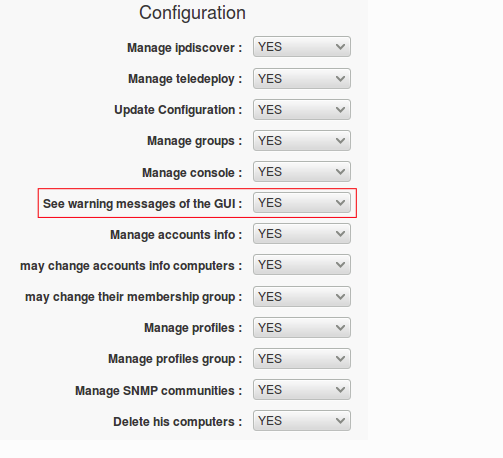

Asegure su servidor OCS Inventory NG
=======================================

Le recomendamos que asegure su OCS Inventory NG Server. Desde OCS Inventory NG 2.0, el mensaje de advertencia le impide un riesgo de seguridad en la consola de administración.

.. figure:: ../images/06.png

Eliminar el archivo de instalación
++++++++++++++++++++++++++++++++++++

Tienes que eliminar **install.php** en el directorio de ocsreports. Generalmente bajo linux en::

	/usr/share/ocsinventory-reports/ocsreports/

Asegure su consola de administración
+++++++++++++++++++++++++++++++++++++

De forma predeterminada, el script de instalación crea una cuenta: admin / admin Tiene que crear su propia cuenta con el perfil de Superadministrador y, a continuación, eliminar la cuenta predeterminada. Otra solución es cambiar la contraseña de la cuenta de administrador.

Acceso seguro mysql
++++++++++++++++++++

Por defecto, el script de instalación crea un usuario de mysql ocs con contraseña ocs. Le recomendamos que cambie la contraseña como mínimo, pero lo mejor es crear un nuevo usuario de mysql.

Crear un nuevo usuario mysql
+++++++++++++++++++++++++++++++

Conecte al MySQl server::

	mysql -u root -p

Cree un nuevo usuario: usuario con contraseña: contraseña con todos los privilegios para la base de datos ocsweb.::

	GRANT ALL PRIVILEGES ON ocsweb.* TO 'user'@'localhost' IDENTIFIED BY 'r00tme' WITH GRANT OPTION;
	
	FLUSH PRIVILEGES;

Modificar archivos de configuración
+++++++++++++++++++++++++++++++++++

archivo **dbconfig.inc.php** Bajo Linux, generalmente en::

	/usr/share/ocsinventory-reports/ocsreports/

	define("DB_NAME", "ocsweb");
	define("SERVER_READ", "localhost");
	define("SERVER_WRITE", "localhost");
	define("COMPTE_BASE", "ocs");
	define("PSWD_BASE", "ocs");

**z-ocsinventory-server.conf file**

Bajo Linux, generalmente en::

	/etc/httpd/conf.d/z-ocsinventory-server.conf

	  # Master Database settings
	  # Replace localhost by hostname or ip of MySQL server for WRITE
	  PerlSetEnv OCS_DB_HOST 192.168.1.210
	  # Replace 3306 by port where running MySQL server, generally 3306
	  PerlSetEnv OCS_DB_PORT 3306
	  # Name of database
	  PerlSetEnv OCS_DB_NAME ocsweb
	  PerlSetEnv OCS_DB_LOCAL ocsweb
	  # User allowed to connect to database
	  PerlSetEnv OCS_DB_USER ocs
	  # Password for user
	  PerlSetVar OCS_DB_PWD passwordhere

**zz-ocsinventory-restapi.conf**

Bajo Linux, generalmente en::

	/etc/httpd/conf.d/zz-ocsinventory-restapi.conf

	<Perl>
	  $ENV{PLACK_ENV} = 'production';
	  $ENV{MOJO_HOME} = '/usr/lib64/perl5/vendor_perl';
	  $ENV{MOJO_MODE} = 'deployment';
	  $ENV{OCS_DB_HOST} = '192.168.1.210';
	  $ENV{OCS_DB_PORT} = '3306';
	  $ENV{OCS_DB_LOCAL} = 'ocsweb';
	  $ENV{OCS_DB_USER} = 'ocs';
	  $ENV{OCS_DB_PWD} = 'ipasswordhere';
	</Perl>

Advertencia: 
	No te olvides de reiniciar Apache. De lo contrario, el servidor OCS Inventory NG devolverá un ERROR 500 a los agentes que lo contactan.

No deje la contraseña de ocs, cambiela::

	SET PASSWORD FOR ocs@'localhost' = PASSWORD('passwordhere');

Si se crearon configuraciones según la ruta de la IP, cambiela a todas las que fueron creadas::

	SET PASSWORD FOR ocs@'192.168.1.210' = PASSWORD('passwordhere');
	SET PASSWORD FOR ocs@'192.168.1.220' = PASSWORD('passwordhere');

**IMPORTANTE** ESTO TRAE PROBLEMA CON EL AGENTE, el agente va leer el archivo z-ocsinventory-server.conf y ahí estara otro usuario y clave que no tiene permisos para la BD

Desactivar el mensaje de advertencia en la consola de administración.
+++++++++++++++++++++++++++++++++++++++++++++++++++++++++++++++++++++

Advertencia: 
	Le recomendamos que asegure su servidor siguiendo los párrafos anteriores, pero si lo desea, puede desactivar el mensaje de advertencia en la GUI

Debe conectarse a la consola de administración, hacer clic en el menu Configuratio luego en Users, luego a mano izquierda el boton de Profiles, elegir el perfil que desea modificar.

Haga clic en Derechos para administrar la pestaña, un conjunto Vea los mensajes de advertencia de la GUI en NO.

Finalmente, registro de modificación.

