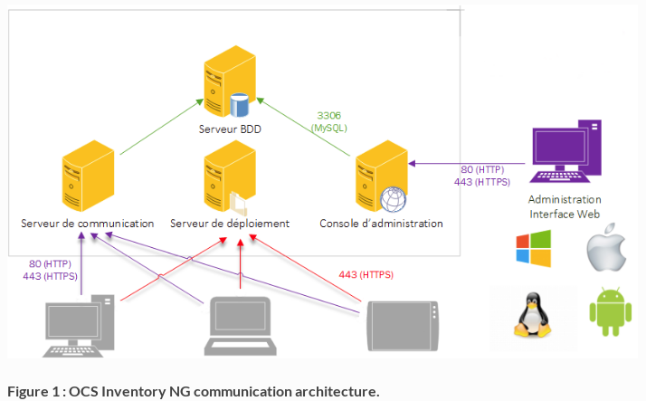

Configuración del servidor de inventario OCS
===============================================

El servidor de administración se compone de 4 componentes principales:

**Servidor de base de datos**, que almacena información de inventario.
**Servidor de comunicaciones**, que maneja las comunicaciones HTTP entre el servidor de base de datos y los agentes.
**Consola de administración**, que permite a los administradores consultar el servidor de la base de datos utilizando su navegador favorito.
**Servidor de implementación**, que almacena toda la configuración de implementación del paquete (¡requiere HTTPS!).
Estos 4 componentes se pueden alojar en una sola computadora o en diferentes computadoras para permitir el equilibrio de carga. Por encima de los 10000 equipos inventariados, recomendamos utilizar al menos 2 servidores físicos, un servidor de base de datos de hosting + servidor de comunicaciones y el otro con una réplica de base de datos + servidor de administración + servidor de implementación.

**El servidor de base de datos** actualmente solo puede ser MySQL 5.4 o superior con el motor InnoDB activo. 
**El servidor de comunicaciones** necesita Apache Web Server 2.2.X / 2.4.X y está escrito en PERL como un módulo de Apache. ¿Por qué? Porque los scripts PERL se compilan cuando se inicia Apache, y no en cada solicitud. Esto es mejor en cuanto a rendimiento. 
**El servidor de comunicación** puede requerir algunos módulos PERL adicionales, de acuerdo con su distribución. 
**El servidor de implementación** necesita cualquier servidor web con SSL habilitado. La consola de administración está escrita en PHP 5.6 (o superior) y se ejecuta en Apache Web Server 2.2.X /2.4.X. La consola de administración requiere compatibilidad con ZIP y GD habilitada en PHP para poder usar el despliegue de paquetes.

Bajo el sistema operativo Linux
+++++++++++++++++++++++++++++++

Suponemos que usted tiene:

* El servidor de base de datos MySQL o MariaDB se ejecuta en algún lugar y escucha en el puerto predeterminado 3306 con la comunicación TCP / IP habilitada.
* El servidor web Apache está instalado y en ejecución para el servidor de comunicaciones y el servidor de administración.
* PHP y Perl instalados y utilizables por el servidor web Apache para la consola de administración.
* Perl y mod_perl instalados y utilizables por el servidor web Apache para el servidor de comunicación.

Requerimientos
++++++++++++++++++

Apache version 2.2 or higher.
Mod_perl version 1.29 or higher.
PHP 5.5 or higher, with ZIP and GD support enabled.
php_curl
php_mbstring
php_soap
php_xml
PERL 5.6 or higher.
Perl module XML::Simple version 2.12 or higher.
Perl module Compress::Zlib version 1.33 or higher.
Perl module DBI version 1.40 or higher.
Perl module DBD::Mysql version 2.9004 or higher.
Perl module Apache::DBI version 0.93 or higher.
Perl module Net::IP version 1.21 or higher.
Perl module SOAP::Lite version 0.66 or higher (optional)
Perl module Mojolicious::Lite
Perl module Plack::Handler
Perl module Archive::Zip
Perl module YAML
Perl module XML::Entities
Perl module Apache2::SOAP
Perl module Switch
MySQL or MariaDB version 4.1.0 or higher with InnoDB engine active. Mysql version upper than 5.5 are not supported but may work.
Make utility such as GNU make.

Nota: 
	la configuración del servidor OCS Inventory NG comprobará todos estos componentes y se cerrará si falta alguno.

Implementación del servidor de base de datos
+++++++++++++++++++++++++++++++++++++++

Ver este link para ver como se hace la instalación de Mariadb para OCS Inventory.

Instalación del servidor de comunicación (requiere módulos PERL)
+++++++++++++++++++++++++++++++++++++++++++++++++++++++++++++++

El servidor de comunicación web requiere el servidor web Apache y el lenguaje de scripting Perl 5 y algunos módulos adicionales para Perl 5 (ver Requisitos). Actúa como un módulo de Apache que maneja las solicitudes de los agentes de inventario HTTP OCS a un directorio virtual/ocsinventory. Ya el servidor de comunicación web requiere dependencias de mysql si elige instalar el servidor de base de datos solo, puede consultar esta página: Implementación del servidor de base de datos

**En OracleLinux/Redhat/Centos 7 como Linux**::

	yum install -y  httpd
	systemctl status httpd
	systemctl enable httpd
	systemctl start httpd
	yum install -y mariadb

Advertencia: 
	debe tener privilegios de root para configurar los módulos perl necesarios. Es mejor para la integridad del sistema utilizar los paquetes precompilados de su distribución cuando están disponibles. Algunos de estos paquetes solo están disponibles en https://fedoraproject.org/wiki/EPEL/FAQ#howtouse

Nota: 
	OracleLinux/Redhat/Centos 7, el paquete "Apache DBI" no estaba en el repositorio EPEL, puede encontrar el rpm aquí. https://centos.pkgs.org/7/epmel-x86_64/perl-Apache-DBI-1.12-2.el7.noarch.rpm.html

**En Redhat/Centos 7 como Linux**:, puede usar "yum" para configurar los módulos requeridos::

	yum install perl-XML-Simple perl-Compress-Zlib perl-DBI perl-DBD-MySQL perl-Net-IP perl-SOAP-Lite perl-Archive-Zip perl-Mojolicious perl-Plack perl-XML-Entities perl-Switch

**En oracle linux**:, Es mejor instalar todos los modulos de PERL desde el CPAN, Ver este link para ver como se hace la instalación de PERL para OCS Inventory.

Instalación de la consola de administración (requiere módulos PHP)
+++++++++++++++++++++++++++++++++++++++++++++++++++++++++++++++++

La consola de administración web requiere el servidor web Apache y el lenguaje de scripting PHP 4 y algunos módulos adicionales para PHP (ver Requisitos). Ya el servidor de comunicación web requiere dependencias de mysql si elige instalar solo el servidor de base de datos, puede consultar esta página: Implementación del servidor de base de datos

**En OracleLinux/Redhat/Centos 7 como Linux**::

	yum instalar httpd
	yum instalar mariadb-cliente

**Instalar PHP Zip soporte y dependencias.**

**En Redhat/Centos 7 como Linux**, puede utilizar "yum" para configurarlo::

	yum install php-pecl-zip
	yum install perl-XML-Simple perl-DBI perl-DBD-MySQL perl-Net-IP

**En oracle linux**:, Es mejor instalar todos los modulos de PERL desde el CPAN, Ver este link para ver como se hace la instalación de PERL para OCS Inventory.

**También es necesario instalar el soporte GD para PHP.**

**En OracleLinux/Redhat/Centos 7 como Linux**::

	yum install php-gd

Instalación de OCS Inventory Server con RPM
+++++++++++++++++++++++++++++++++++++++++++++++++

puedes instalar el servidor ocs con RPM

**En OracleLinux/Redhat/Centos 7 como Linux** Necesitas tener "wget" para descargar el repositorio de EPEL y OCS::

	wget https://dl.fedoraproject.org/pub/epel/epel-release-latest-7.noarch.rpm
	wget https://rpm.ocsinventory-ng.org/ocsinventory-release-latest.el7.ocs.noarch.rpm

Puedes instalar el repositorio con "yum"::

	yum install ocsinventory-release-latest.el7.ocs.noarch.rpm epel-release-latest-7.noarch.rpm

Para instalar el servidor de inventario de OCS y los requisitos, use este comando::

	yum install ocsinventory-server

Nota: 
	el servidor se instalará de forma predeterminada, como usar setup.sh

Instalación del management server
++++++++++++++++++++++++++++++++++++

Debe tener privilegios de root para configurar OCS Inventory Server.

Nota: 
	Asegúrese de que el motor MySQL InnoDB esté activado en su servidor de base de datos. Abra my.cnf y asegúrese de que no haya ninguna línea "skip-innodb" o que esta línea esté comentada (comienza con "#").

Descargue la última versión del servidor tarball "OCSNG_UNIX_SERVER-2.4.x.tar.gz" desde el sitio web de inventario de OCS.::

	tar xvzf OCSNG_UNIX_SERVER_2.5.tar.gz
	cd OCSNG_UNIX_SERVER_2.5

Ejecute el instalador "setup.sh". Durante el instalador, la opción predeterminada se presenta entre []. Por ejemplo, [y] / n significa que "y" (sí) es la opción predeterminada, y "n" (no) es la otra opción.::

	./setup.sh

Nota: 
	el instalador escribe un archivo de registro "ocs_server_setup.log" en el mismo directorio. Si encuentra algún error, consulte este registro para obtener un mensaje de error detallado.

Advertencia: 
	si está actualizando desde OCS Inventory NG 1.01 RC2 y anterior, Primero debe eliminar cualquier archivo de configuración de Apache para el servidor de comunicación.
::

	Do you wish to continue ([y]/n)?

Escriba "y" o "entrar" para continuar con la instalación::

	Which host is running database server [localhost] ?

Escriba “y” o “ingresar” para validar y luego ingrese la dirección de host del servidor MySQL, en la mayoría de los casos localhost.

Luego, la configuración comprueba si hay archivos binarios del cliente MySQL versión 4.1 o superior. Si no está presente, se le pedirá que continúe o cancele la configuración.::

	On which port is running database server [3306] ?

Si todo está bien, ingrese el puerto del servidor MySQL, generalmente 3306.::

	Where is Apache daemon binary [/usr/sbin/httpd] ?

Ingrese o valide la ruta al binario del daemon de Apache, generalmente "/usr/sbin/httpd". Se utilizará para encontrar los archivos de configuración de Apache.

Nota: 
	Si no está utilizando el daemon Apache del sistema, pero otro como el servidor Apache XAMPP/LAMPP, debe ingresar la ruta completa a su demonio de Apache, no a la del sistema.
::

	Where is Apache main configuration file [/etc/httpd/conf/httpd.conf] ?

Ingrese o valide la ruta del archivo de configuración principal de Apache, generalmente "/etc/apache2/conf/apache2.conf" o "/etc/httpd/conf/httpd.conf".

	Which user account is running Apache web server [apache] ?

Ingrese o valide la cuenta de usuario que ejecuta el daemon de Apache, generalmente "apache" o "www" (en Debian/Ubuntu está "www-data").::

	Which user group is running Apache web server [apache] ?

Ingrese o valide el grupo de usuarios del demonio de Apache, generalmente "apache" o "www" (bajo Debian/Ubuntu está "www-data").::

	Where is Apache Include configuration directory [/etc/httpd/conf.d] ?

Incluimos el archivo de configuración en la ruta por defecto::

	Where is PERL interpreter binary [/usr/bin/perl] ?

A continuación, la configuración comprueba los binarios de intérprete de PERL. Introduzca o valide la ruta al intérprete PERL.

Nota: 
Si no está utilizando el intérprete de perl del sistema, pero otro como intérprete de perl de XAMPP/LAMPP, debe especificar la ruta completa a este intérprete de Perl, no el sistema predeterminado (/opt/lampp/bin/perl generalmente se usa en XAMPP/LAMPP).::

	Do you wish to setup Communication server on this computer ([y]/n)?

Ahora se recopila información común para configurar el servidor de comunicaciones o la consola de administración. El programa de instalación le pregunta si desea configurar el servidor de comunicación en esta computadora. Ingrese “y” o valide para configurar el servidor de comunicación, “n” para omitir la instalación del servidor de comunicación.

El programa de instalación intentará encontrar la utilidad make. Si falla, la configuración se detendrá.

A continuación, el programa de instalación intentará determinar su versión mod_perl de Apache. Si no puede determinar la versión mod_perl, le pedirá que la ingrese.

Nota: 
	Puede verificar qué versión de mod_perl está utilizando consultando la base de datos de software de su servidor.

Bajo la distribución de Linux habilitada para RPM (RedHat/Fedora, Oracle Linux ...)::

	rpm –q mod_perl
	mod_perl-2.0.10-3.el7.x86_64

	Which version of Apache mod_perl the computer is running ([1]/2) ? 2

El servidor de comunicación puede crear registros detallados. Estos registros se pueden habilitar estableciendo el valor entero de LOGLEVEL en 1 en la configuración del menú de la consola de administración.::

	Where to put Communication server log directory [/var/log/ocsinventory-server] ?

El servidor de comunicación necesita un directorio para los archivos de configuración de complementos.::

	Where to put Communication server plugins configuration files [/etc/ocsinventory-server/plugins] ?

Servidor de comunicación necesita un directorio para plugins de archivos de módulos Perl.::

	Where to put Communication server plugins Perl modules files [/etc/ocsinventory-server/perl] ?

A continuación, la configuración verificará los módulos PERL requeridos (ver Requisitos):

XML::Simple version 2.12 or higher
Compress::Zlib version 1.33 or higher
DBI version 1.40 or higher
DBD::mysql version 2.9004 or higher
Apache::DBI version 0.93 or higher
Net::IP version 1.21 or higher
SOAP::Lite version 0.66 or higher
Apache2::SOAP
Switch

Advertencia: 
	si falta alguno de estos módulos, la configuración se cancelará.

La configuración le preguntará si desea instalar la API de descanso.::

	Do you wish to setup Rest API server on this computer ([y]/n)?

preguntándole dónde quiere almacenar el código API::

	Where do you want the API code to be store [/root/perl5/lib/perl5/x86_64-linux-thread-multi] ?

Si todo está bien, se instalará el servidor de comunicación:

Configurar el módulo PERL del servidor de comunicación.
Construir el módulo PERL del servidor de comunicación.
Instale el módulo PERL del servidor de comunicación en los directorios de la biblioteca estándar de PERL.
Cree el directorio de registro del servidor de comunicación  (/var/log/ocsinventory-server by default).
Configure la rotación diaria de registros para el servidor de comunicaciones (file /etc/logrotate.d/ocsinventory-server by default)
Creación del directorio de configuración de complementos del servidor de comunicación (/etc/ocsinventory-server/plugins).
Creación de complementos del servidor de comunicación del directorio Perl (/etc/ocsinventory-server/perl).

Cree el archivo de configuración de Apache (ocsinventory-server.conf). Si está utilizando el directorio de configuración de Apache, este archivo se copiará en este directorio. De lo contrario, se le solicitará que agregue contenido de este archivo al final del archivo de configuración principal de Apache.::

	Do you allow Setup renaming Communication Server Apache configuration file to 'z-ocsinventory-server.conf' ([y]/n) ?

Culmina la instalación del Servidor de comunicación::

	+----------------------------------------------------------------------+
	|       OK, Communication server setup successfully finished ;-)       |
	|                                                                      |
	| Please, review /etc/httpd/conf.d/z-ocsinventory-server.conf |
	|         to ensure all is good. Then restart Apache daemon.           |
	+----------------------------------------------------------------------+

Ahora nos pregunta si instalaremos en este server la Consola Administrativa.::

	Do you wish to setup Administration Server (Web Administration Console) on this computer ([y]/n)?

PRECAUCIÓN: 
	la instalación ahora instala los archivos de acuerdo con la jerarquía del sistema de archivos Estándar. Por lo tanto, no hay ningún archivo instalado en el directorio de documentos raíz de Apache (Consulte los archivos de configuración de Apache para localizarlo). Si está actualizando desde OCS Inventory NG Server 1.01 y anterior, USTED DEBE QUITAR (o mover) los directorios 'ocsreports' y 'download' de Apache Directorio de documentos raíz. Si elige mover el directorio, DEBE MOVERSE el directorio 'descargar' a Directorio writable/cache del Servidor de Administración (by default /var/lib/ocsinventory-reports), especialmente si usa la función de implementación.

::

	Do you wish to continue ([y]/n)?

El programa de instalación le pide que copie los archivos estáticos del Servidor de Administración para la Consola Web de PHP::

	Where to copy Administration Server static files for PHP Web Console
	[/usr/share/ocsinventory-reports] ?

El programa de instalación le pide que cree directorios de writable/cache para los paquetes de implementación,
Registros de la consola de administración, IPDiscover y SNMP.::

	Where to create writable/cache directories for deployment packages,
	administration console logs, IPDiscover and SNMP [/var/lib/ocsinventory-reports] ?

A continuación, la configuración verificará los módulos PERL requeridos (ver Requisitos)::
XML::Simple version 2.12 or higher
DBI version 1.40 or higher
DBD::Mysql version 2.9004 or higher
Net::IP version 1.21 or higher
Apache::DBI
Compress::Zlib
SOAP::Lite
Archive::Zip

Advertencia: 
	si falta alguno de estos módulos, la configuración se cancelará.

Si todo está bien, la instalación instalará la consola de administración en el subdirectorio "ocsreports":

Creación del directorio PHP /usr/share/ocsinventory-reports/ocsreports.
Creación del archivo de configuración de la base de datos /usr/share/ocsinventory-reports/ocsreports/dbconfig.inc.php.
Creando el directorio IPDiscover /var/lib/ocsinventory-reports/ipd.
Creando el directorio de paquetes /var/lib/ocsinventory-reports/download.
Creando el directorio snmp mibs /var/lib/ocsinventory-reports/snmp.
Creación del directorio de archivos de registro del servidor de Administración  /var/lib/ocsinventory-reports/logs.
Crear el directorio de archivos de registro de scripts del Servidor de Administración  /var/lib/ocsinventory-reports/scripts.
Configuración / Instalación del script Perl de IPDISCOVER-UTIL.
Escribiendo la configuración del servidor de administración en el archivo /etc/apache2/conf-available/ocsinventory-reports.conf
Arregle los permisos de los directorios y archivos para permitir que el daemon de Apache lea y escriba en los directorios requeridos (se requiere acceso de escritura en /ocsreports, /ocsreports/ipd and /download, cf § 11.4 Permisos de archivos y directorios en Linux).
Configure el script PERL ipdiscover-util.pl para acceder a la base de datos e instalarlo.

Configuración del management server
+++++++++++++++++++++++++++++++++++++++++

Advertencia: 
	Le recomendamos que revise su php.ini cuando actualice su servidor de 1.x a 2.x, especialmente estas variables:

	max_execution_time
	max_input_time
	memory_limit

Otorgamos permisos y valores del PHP.::

	chown -R apache.apache /usr/share/ocsinventory-reports/

	vi /etc/php.ini
	post_max_size = 1024M
	upload_max_filesize = 1024M

Ahora, puede reiniciar el servidor web Apache para que los cambios surtan efecto.::

	systemctl restart httpd

Nota: 
	No está obligado a iniciar install.php, también puede usar este comando::

	mysql -f -hlocalhost -uroot -p DBNAME < ocsbase.sql >log.log

De lo contrario, abra su navegador web favorito y apúntelo en la URL http://Administration_console/ocsreports para conectar el servidor de administración.

Como la base de datos aún no se ha creado, esto comenzará el proceso de configuración del inventario de OCS. De lo contrario, puede volver a ejecutar el proceso de configuración explorando la URL http://administration_console/ocsreports/install.php (esto debe usarse al actualizar el servidor de administración de inventario OCS).

